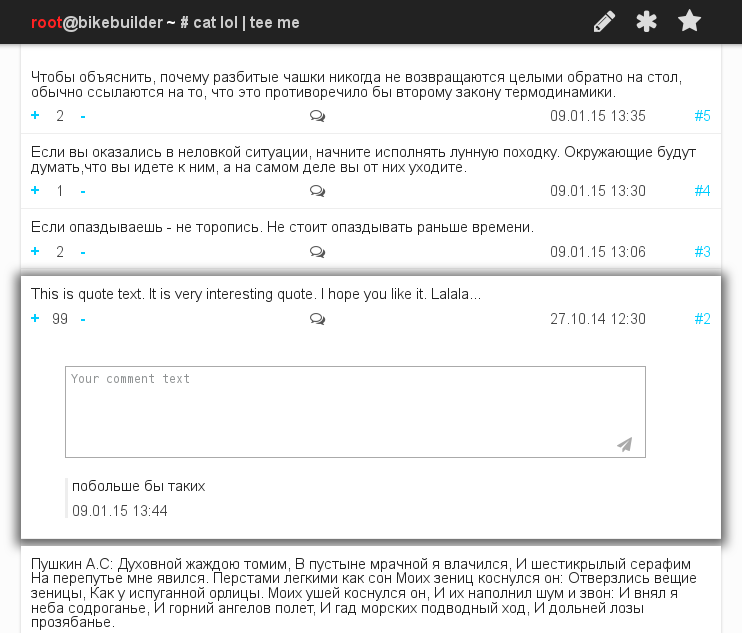

#  /bin/tee
bash.im / bash.org.ru / bash.org -like service __with comments__ (no more abyss overflow!)

## Pages
 - _/_ - all quotes
 - _/top_ - quotes which rating >= 100
 - _/q1_ - link on quote #1 __(/q\*id\*)__
 - _/add_ - page for writing new quotes. __Normally it is not required__.

## REST
* GET
 - _/quotes_ - get all quotes
 - _/quotes/top_ - get top quotes
 - _/quotes/1_ - get quote #1
 - _/quotes/1/comments_  - get comments of quote #1

* POST
 - _/quotes_ - add quote
 - _/quotes/1/comments_ - add comment for #1 quote
 - _/quotes/1/vote_ - vote #1 quote

 
## Additional files
`initQuotes.js` - database initialization script

`config.js` - configuration file
 

## Dependencies

### Client-side
 - jQuery
 - AngularJS
 - Font Awesome
 - Eric Meyer's Reset CSS v2.0

### Server-side
 - Node.js
   - express
   - jade
   - node-redis
 - Redis
